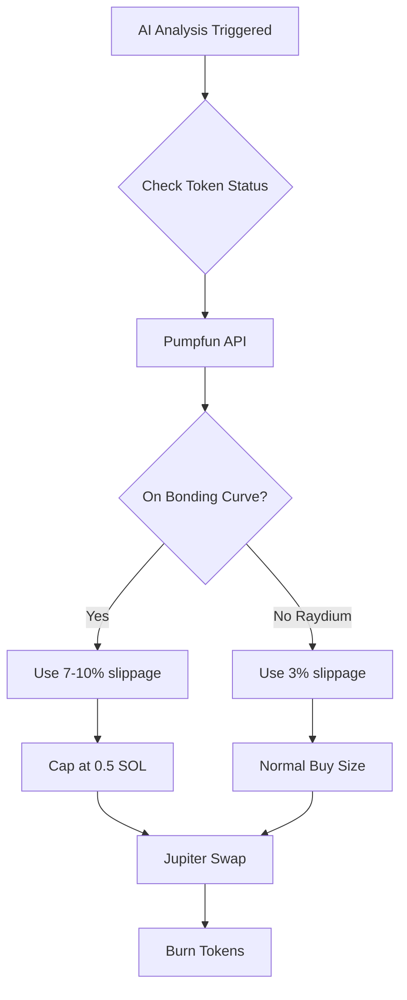

# Pumpfun Bonding Curve Optimization

## Changes Made

### ✅ **2-Minute AI Analysis** (was 15 minutes)
**Why**: Memecoin volatility moves FAST. 15 minutes is way too slow to catch dips effectively.

- Changed interval to **2 minutes** for rapid dip detection
- AI now analyzes charts 7.5x more frequently
- Better chance of catching profitable entry points

### ✅ **Pumpfun Bonding Curve Support**
**Yes, this works on pumpfun!** Jupiter automatically routes through the bonding curve.

**Added Smart Features:**
1. **Bonding Curve Detection** - Bot now checks if token is still on curve or graduated to Raydium
2. **Dynamic Slippage** - Automatically adjusts:
   - Early bonding curve (< 50% to graduation): **10% slippage**
   - Late bonding curve (50-100% to graduation): **7% slippage**
   - Graduated to Raydium: **3% slippage**
3. **Safety Limits** - Caps buys at **0.5 SOL** on bonding curve to avoid excessive slippage
4. **Progress Tracking** - Logs how close to $69k graduation threshold

## How It Works



## Example Flow

**Early Bonding Curve Token:**
```
1. AI detects 5% dip (Standard mode)
2. Bot checks: "On bonding curve, 30% to graduation"
3. Uses 10% slippage tolerance
4. Caps buy at 0.5 SOL (safety)
5. Jupiter routes through pumpfun bonding curve
6. Tokens burned
```

**Graduated Token (Raydium):**
```
1. AI detects 5% dip
2. Bot checks: "Graduated to Raydium"
3. Uses 3% slippage
4. Full buy amount
5. Jupiter swaps on Raydium
6. Tokens burned
```

## Files Modified

- [`config.ts`](file:///C:/Users/Administrator/.gemini/antigravity/scratch/claude-burn-bot/src/config.ts) - Changed AI interval to 2min
- [`buyback.ts`](file:///C:/Users/Administrator/.gemini/antigravity/scratch/claude-burn-bot/src/buyback.ts) - Added pumpfun-aware logic
- [`pumpfun-utils.ts`](file:///C:/Users/Administrator/.gemini/antigravity/scratch/claude-burn-bot/src/pumpfun-utils.ts) - New utility module
- [`scheduler.ts`](file:///C:/Users/Administrator/.gemini/antigravity/scratch/claude-burn-bot/src/scheduler.ts) - Updated comment

## Performance Impact

**Before:**
- AI checks every 15 minutes
- Fixed 3% slippage (would fail on bonding curve)
- No bonding curve awareness

**After:**
- AI checks every 2 minutes ⚡
- Dynamic slippage (3-10% based on liquidity)
- Safety caps prevent excessive slippage
- Bonding curve progress logging

## Next Steps

When you run the bot, you'll see logs like:
```
[INFO] Token on bonding curve: 45.2% to graduation
[INFO] Using 10% slippage for bonding curve trade
[SUCCESS] Buyback executed: 0.5 SOL -> 12,500 tokens
```

This ensures maximum efficiency whether the token is on pumpfun's bonding curve or already graduated to Raydium!
